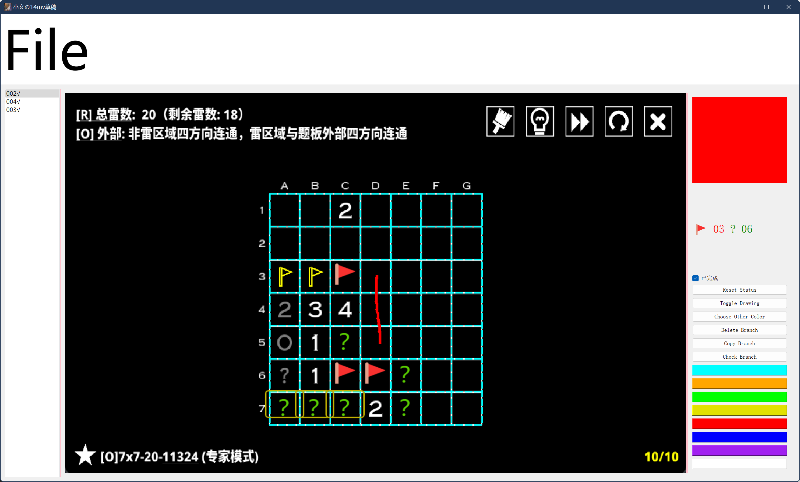

[English Version](README_English.md)

# [14mv_draft] 简介

这个程序是专为《14种扫雷变体》（14 Minesweeper Variants Demo，简称14mv）开发的即开即用的草稿软件，特别定制给小文@initrel-0xardye，旨在提供丰富的草稿功能和更优秀的分类讨论支持。通过14mv_draft，你可以告别传统纸笔，轻松应对扫雷挑战（至少我们这么希望）。

# 界面介绍与使用方法

1. **导入题板截图**：通过菜单栏的file选项使用import功能，可以导入扫雷题板的截图。14mv_draft将自动检测题板尺寸，绘制在画面上，并创建一个初始分支。
2. **界面布局**：14mv_draft的界面分为三部分：左侧的分支列表，中间的草稿板，以及右侧的功能菜单。
3. **草稿与分类讨论**：在草稿区域中心，你可以标记雷与非雷，创建分支进行分类讨论。
4. **自动检测解决方案**：讨论结束后，14mv_draft会自动检测是否有格子在所有分支中都具有相同解。如果有，将以黄色方框标注，这意味着对应格子已解决。

# 主要功能与快捷键

- **分类讨论**：鼠标中键点击对应位置自动创建两个分支，分别讨论当前格是否为雷。
- **一键检查所有分类（check branch）**：空格键检查是否有格子在所有分类中具有唯一解。
- **标记雷与非雷**：左键标非雷，右键标雷，再次点击可取消。
- **切换绘图模式（toggle drawing）**：按`D`在绘图模式和扫雷模式间切换，右侧颜色区域可选预设或自定义画笔颜色。左键绘图，右键橡皮擦。
- **清除画笔痕迹**：按`X`清除当前分支的画笔痕迹。
- **复制当前分支（copy branch）**：按`C`复制当前分支。
- **删除当前分支（delete branch）**：按`Delete`删除当前分支。
- **标记分支完成状态**：按`Enter`标记当前分支完成状态，再次按下取消标记。用于记录讨论过的分支（已完成/未完成）。
- **重置分支状态（reset status）**：按`N`重置所有分支至未处理状态。
- **快速切换分支**：使用上下箭头键快速切换分支。

这些快捷键让你在应用程序聚焦时通过键盘即可执行关联动作，提升工作流程的顺畅度和功能访问速度。

# 安装说明

- 需要Python版本 >=3.6（开发时使用的是3.7.13）。
- 克隆仓库：`git clone https://github.com/Thecats-Jfm/14mv_draft.git`
- 安装依赖：`pip install -e .`

# 启动程序

通过命令行运行 `14mvd` 即可启动程序。

# 注意事项

- 当前版本支持的配色方案包括预设配色1与粉白配色，具体参见`img/pink_white.png`与`img/set1.png`。

# 界面截图示例

*爱老婆*